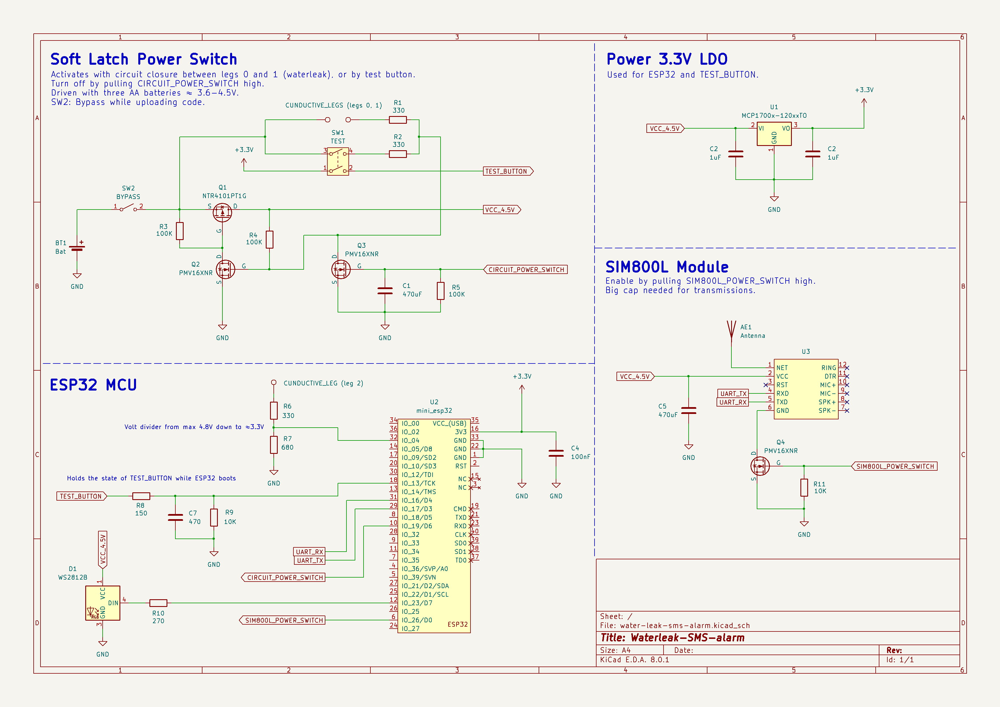
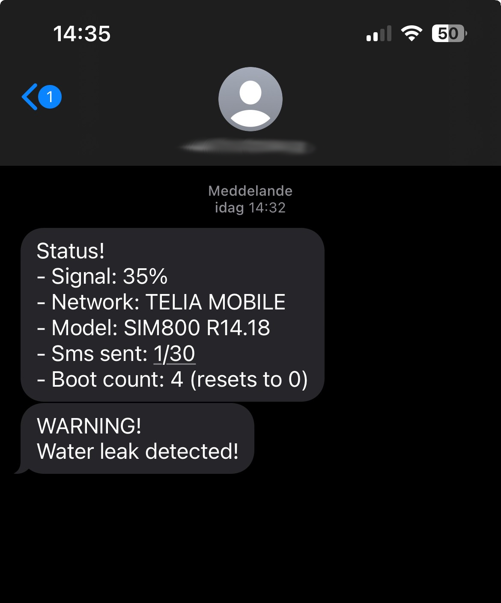

# water-leak-sms-alarm   
A small battery-powered device that detects water leakage and sends an SMS alert.  
&nbsp;

## Features
- Completely `off` until water *(or anything conductive)* closes the circuit between two of its legs,  
thereby latching on the "soft latching power circuit".  
Which is later turned off again by the microcontroller.

- Latches `on` by either water detection or by pressing the test button.

- Sends an SMS alert if water is detected.

- Sends SMS diagnostics if the test button is pressed.

- Built with an ESP32 and PlatformIO, in C++.

&nbsp; 

## Schematic
KiCad files can be found here: 
[📂 _KiCad/](./_KiCad/)  
More images in: 
[📂 _images/](./_images/)

    

        Parts used
    
   

- ESP32 Wemos D1 Mini  
- SIM800L with external antenna  
- 3.3V LDO: MCP1700-3302E (250mA)
- LED: WS2812B  
- P-channel mos: NTR4101PT1G 
- N-channel mos: PMV16XNR  
- Cap 470uF: Electrolytic  
- Cap 1uF: Ceramic  
- Cap 100nF: Ceramic
- SW1: Momentary DPST switch  
- Conductive legs in copper/brass

&nbsp;

## SMS Example

